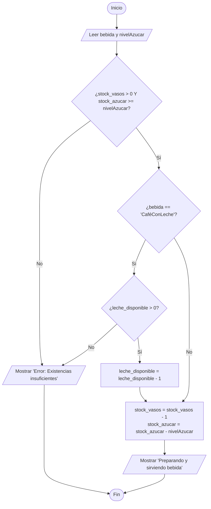
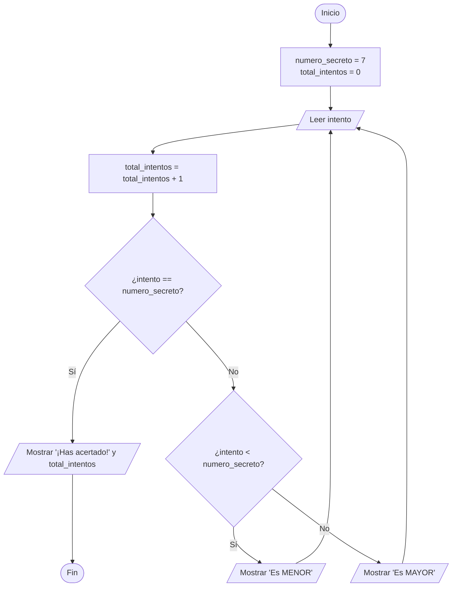
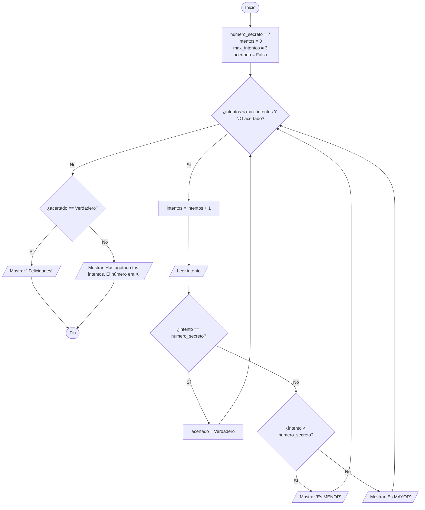
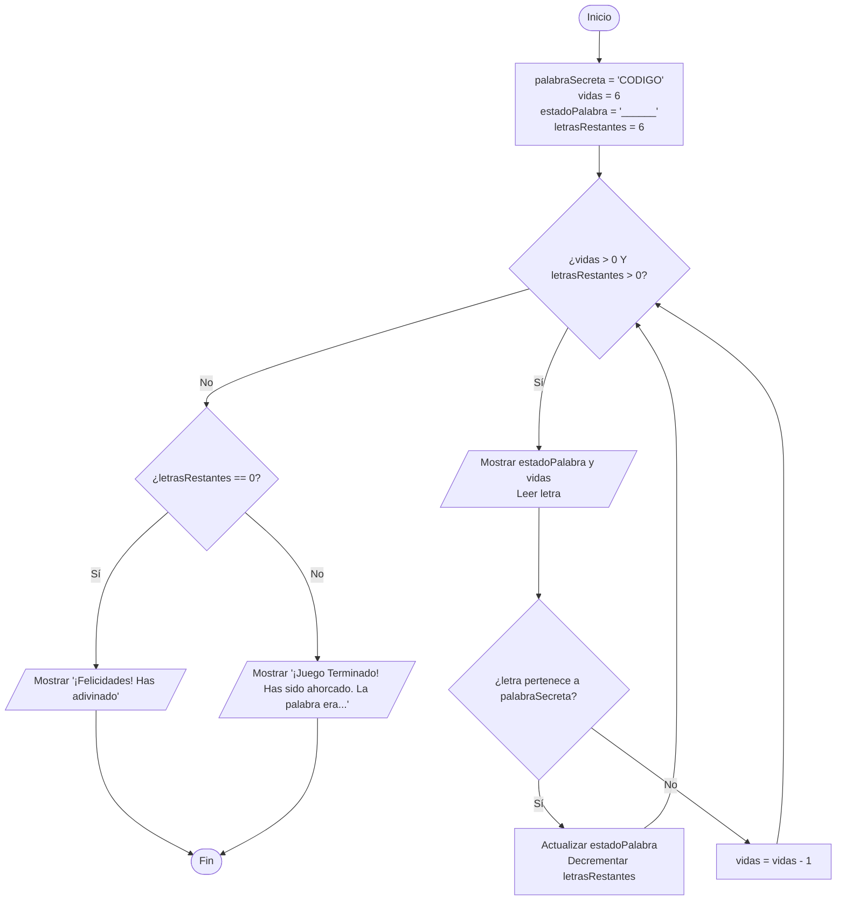

# Solución de Retos Prácticos de Algoritmos (Diagramas de Flujo y Pseudocódigo)

---

**Guía de representación:** Este documento contiene la solución completa a los 6 retos propuestos. Para cada reto se incluye el **Pseudocódigo estructurado (estilo PSeInt)** y la representación visual del **Diagrama de Flujo (estándar Mermaid.js / Draw.io)** lista para usar o importar en herramientas de diagramación.

---

# Reto 1: Contador y Acumulador de Números Pares (Finalización con "No")

## 1. Pseudocódigo

```pseudocode
Algoritmo ContadorAcumuladorPares
    Definir entrada Como Cadena
    Definir numero, contadorPares, sumaPares Como Entero
    
    contadorPares <- 0
    sumaPares <- 0
    
    Escribir "Ingrese un número o 'No' para terminar:"
    Leer entrada
    
    Mientras Minusculas(entrada) <> "no" Hacer
        numero <- ConvertirANumero(entrada)
        
        Si numero % 2 == 0 Entonces
            contadorPares <- contadorPares + 1
            sumaPares <- sumaPares + numero
        FinSi
        
        Escribir "Ingrese otro número o 'No' para terminar:"
        Leer entrada
    FinMientras
    
    Escribir "Total de números pares encontrados: ", contadorPares
    Escribir "Suma acumulada de números pares: ", sumaPares
FinAlgoritmo
```

## 2. Diagrama de Flujo (Mermaid / Draw.io)

```mermaid
flowchart TD
    A([Inicio]) --> B[contadorPares = 0<br>sumaPares = 0]
    B --> C[/Leer entrada/]
    C --> D{¿entrada == 'No'?}
    D -- Sí --> E[/Mostrar contadorPares y sumaPares/]
    E --> F([Fin])
    D -- No --> G[numero = Convertir(entrada)]
    G --> H{¿numero % 2 == 0?}
    H -- Sí --> I[contadorPares = contadorPares + 1<br>sumaPares = sumaPares + numero]
    H -- No --> J[/Leer entrada/]
    I --> J
    J --> D
```

---

# Reto 2: Verificador de Secuencia Ordenada (Finalización con "No")

## 1. Pseudocódigo

```pseudocode
Algoritmo VerificadorSecuenciaOrdenada
    Definir entrada Como Cadena
    Definir numeroAnterior, numeroActual Como Real
    Definir estaOrdenada Como Logico
    
    estaOrdenada <- Verdadero
    
    Escribir "Ingrese el primer número para iniciar la secuencia:"
    Leer entrada
    
    Si Minusculas(entrada) <> "no" Entonces
        numeroAnterior <- ConvertirANumero(entrada)
        
        Escribir "Ingrese el siguiente número o 'No' para finalizar:"
        Leer entrada
        
        Mientras Minusculas(entrada) <> "no" Hacer
            numeroActual <- ConvertirANumero(entrada)
            
            Si numeroActual <= numeroAnterior Entonces
                estaOrdenada <- Falso
            FinSi
            
            numeroAnterior <- numeroActual
            
            Escribir "Ingrese el siguiente número o 'No' para finalizar:"
            Leer entrada
        FinMientras
    FinSi
    
    Si estaOrdenada Entonces
        Escribir "La secuencia introducida estuvo correctamente ordenada de forma ascendente."
    Sino
        Escribir "La secuencia introducida NO estuvo ordenada de forma ascendente."
    FinSi
FinAlgoritmo
```

## 2. Diagrama de Flujo (Mermaid / Draw.io)

```mermaid
flowchart TD
    A([Inicio]) --> B[estaOrdenada = Verdadero]
    B --> C[/Leer entrada/]
    C --> D{¿entrada == 'No'?}
    D -- Sí --> E{¿estaOrdenada == Verdadero?}
    E -- Sí --> F[/Mostrar 'Secuencia Ordenada'/]
    E -- No --> G[/Mostrar 'Secuencia NO Ordenada'/]
    F --> H([Fin])
    G --> H
    D -- No --> I[numeroAnterior = Convertir(entrada)]
    I --> J[/Leer entrada/]
    J --> K{¿entrada == 'No'?}
    K -- Sí --> E
    K -- No --> L[numeroActual = Convertir(entrada)]
    L --> M{¿numeroActual <= numeroAnterior?}
    M -- Sí --> N[estaOrdenada = Falso]
    M -- No --> O[numeroAnterior = numeroActual]
    N --> O
    O --> J
```

---

# Reto 3: Máquina Dispensadora Automática de Bebidas Calientes

## 1. Tabla de Inventario de Ejemplo

| Recurso / Ingrediente | Variable de Stock | Requisito mínimo |
| :--- | :--- | :--- |
| **Vasos** | `stock_vasos` | `> 0` |
| **Leche** | `leche_disponible` | `> 0` (Solo para CaféConLeche) |
| **Azúcar** | `stock_azucar` | `>= nivel_azucar` (0 a 5) |

## 2. Pseudocódigo

```pseudocode
Algoritmo DispensadoraBebidas
    Definir bebida Como Cadena
    Definir nivelAzucar Como Entero
    
    // Variables de inventario preexistentes:
    // stock_vasos, leche_disponible, stock_azucar
    
    Escribir "Seleccione la bebida deseada (CaféSolo, CaféConLeche, Chocolate):"
    Leer bebida
    
    Escribir "Seleccione el nivel de azúcar (0 al 5):"
    Leer nivelAzucar
    
    // Validar existencias
    Si stock_vasos <= 0 O stock_azucar < nivelAzucar Entonces
        Escribir "Error: Existencias insuficientes"
    Sino
        Si bebida == "CaféConLeche" Y leche_disponible <= 0 Entonces
            Escribir "Error: Existencias insuficientes"
        Sino
            // Descontar inventario
            stock_vasos <- stock_vasos - 1
            stock_azucar <- stock_azucar - nivelAzucar
            
            Si bebida == "CaféConLeche" Entonces
                leche_disponible <- leche_disponible - 1
            FinSi
            
            Escribir "Preparando y sirviendo su bebida: ", bebida, " con azúcar nivel ", nivelAzucar
            Escribir "¡Que la disfrute!"
        FinSi
    FinSi
FinAlgoritmo
```

## 3. Diagrama de Flujo (Mermaid / Draw.io)



---

# Reto 4: Control de Acceso a Montaña Rusa con Cola de Espera (5 Visitantes)

## 1. Criterios de Evaluación por Visitante

| Altura (cm) | Edad (Años) | Acompañado por Adulto | Resultado |
| :--- | :--- | :--- | :--- |
| `>= 140 cm` | `>= 12 años` | Indiferente | **Permitido (Individual)** |
| `120 cm a 139 cm` | Cualquiera | **SÍ** | **Permitido (Acompañado)** |
| `120 cm a 139 cm` | Cualquiera | **NO** | **Rechazado** |
| `< 120 cm` | Cualquiera | Indiferente | **Rechazado** |

## 2. Pseudocódigo

```pseudocode
Algoritmo ControlMontanaRusa
    Definir i, altura_cm, edad, pendientes Como Entero
    Definir acompanado Como Cadena
    
    Para i <- 1 Hasta 5 Con Paso 1 Hacer
        pendientes <- 5 - i
        Escribir "--- Turno Visitante ", i, " ---"
        Escribir "Ingrese la altura en cm:"
        Leer altura_cm
        Escribir "Ingrese la edad:"
        Leer edad
        
        Si altura_cm >= 140 Y edad >= 12 Entonces
            Escribir "Acceso Autorizado: Individual"
        Sino
            Si altura_cm >= 120 Y altura_cm <= 139 Entonces
                Escribir "¿Va acompañado por un adulto? (SÍ/NO):"
                Leer acompanado
                
                Si Mayusculas(acompanado) == "SÍ" O Mayusculas(acompanado) == "SI" Entonces
                    Escribir "Acceso Autorizado: Acompañado"
                Sino
                    Escribir "Acceso Rechazado: Requiere adulto acompañante"
                FinSi
            Sino
                Escribir "Acceso Rechazado: Estatura insuficiente"
            FinSi
        FinSi
        
        Escribir "Visitantes pendientes en la cola: ", pendientes
        Escribir ""
    FinPara
    
    Escribir "La cola de la montaña rusa ha finalizado."
FinAlgoritmo
```

## 3. Diagrama de Flujo (Mermaid / Draw.io)

```mermaid
flowchart TD
    A([Inicio]) --> B[i = 1]
    B --> C{¿i <= 5?}
    C -- No --> D[/Mostrar 'Cola finalizada'/] --> E([Fin])
    C -- Sí --> F[/Leer altura_cm y edad/]
    F --> G{¿altura_cm >= 140 Y edad >= 12?}
    G -- Sí --> H[/Mostrar 'Permitido (Solo)'/]
    G -- No --> I{¿altura_cm >= 120 Y altura_cm <= 139?}
    I -- No --> J[/Mostrar 'Rechazado'/]
    I -- Sí --> K[/Leer acompanado SÍ/NO/]
    K --> L{¿acompanado == 'SÍ'?}
    L -- Sí --> M[/Mostrar 'Permitido (Acompañado)'/]
    L -- No --> J
    H --> N[pendientes = 5 - i<br>Mostrar pendientes]
    M --> N
    J --> N
    N --> O[i = i + 1] --> C
```

---

# Reto 5: Juego "Adivina el Número" (Versión por Intentos y por Límite)

## Variante A: Sin Límite de Intentos (Hasta acertar)

### Pseudocódigo (Variante A)

```pseudocode
Algoritmo AdivinaElNumero_VarianteA
    Definir numero_secreto, intento, total_intentos Como Entero
    numero_secreto <- 7
    total_intentos <- 0
    
    Repetir
        Escribir "Adivina el número secreto (1-10):"
        Leer intento
        total_intentos <- total_intentos + 1
        
        Si intento < numero_secreto Entonces
            Escribir "El número ingresado es MENOR que el número secreto."
        Sino
            Si intento > numero_secreto Entonces
                Escribir "El número ingresado es MAYOR que el número secreto."
            FinSi
        FinSi
    Hasta Que intento == numero_secreto
    
    Escribir "¡Has acertado!"
    Escribir "Número total de intentos: ", total_intentos
FinAlgoritmo
```

### Diagrama de Flujo - Variante A



---

## Variante B: Límite Máximo de 3 Intentos

### Pseudocódigo (Variante B)

```pseudocode
Algoritmo AdivinaElNumero_VarianteB
    Definir numero_secreto, intento, intentos, max_intentos Como Entero
    Definir acertado Como Logico
    
    numero_secreto <- 7
    max_intentos <- 3
    intentos <- 0
    acertado <- Falso
    
    Mientras intentos < max_intentos Y NO acertado Hacer
        intentos <- intentos + 1
        Escribir "Intento ", intentos, " de ", max_intentos, ". Ingrese un número:"
        Leer intento
        
        Si intento == numero_secreto Entonces
            acertado <- Verdadero
        Sino
            Si intento < numero_secreto Entonces
                Escribir "El número ingresado es MENOR que el número secreto."
            Sino
                Escribir "El número ingresado es MAYOR que el número secreto."
            FinSi
        FinSi
    FinMientras
    
    Si acertado Entonces
        Escribir "¡Felicidades! Has acertado en el intento ", intentos
    Sino
        Escribir "Has agotado tus intentos. El número era ", numero_secreto
    FinSi
FinAlgoritmo
```

### Diagrama de Flujo - Variante B



---

# Reto 6: Juego Completo del Ahorcado

## 1. Pseudocódigo

```pseudocode
Algoritmo JuegoAhorcado
    Definir palabraSecreta, letra, estadoPalabra Como Cadena
    Definir vidas, i, letrasRestantes Como Entero
    Definir acierto Como Logico
    
    palabraSecreta <- "CODIGO"
    vidas <- 6
    estadoPalabra <- "______"
    letrasRestantes <- 6
    
    Mientras vidas > 0 Y letrasRestantes > 0 Hacer
        Escribir "Estado actual: ", estadoPalabra
        Escribir "Vidas restantes: ", vidas
        Escribir "Ingrese una letra:"
        Leer letra
        letra <- Mayusculas(letra)
        
        acierto <- Falso
        
        Para i <- 1 Hasta Longitud(palabraSecreta) Con Paso 1 Hacer
            Si Subcadena(palabraSecreta, i, i) == letra Entonces
                Si Subcadena(estadoPalabra, i, i) == "_" Entonces
                    estadoPalabra <- ReemplazarEnPosicion(estadoPalabra, i, letra)
                    letrasRestantes <- letrasRestantes - 1
                FinSi
                acierto <- Verdadero
            FinSi
        FinPara
        
        Si acierto Entonces
            Escribir "¡Bien hecho! La letra está en la palabra."
        Sino
            vidas <- vidas - 1
            Escribir "La letra NO está en la palabra. Pierdes una vida."
        FinSi
        Escribir "-------------------------------------------"
    FinMientras
    
    Si letrasRestantes == 0 Entonces
        Escribir "¡Felicidades! Has adivinado la palabra: ", palabraSecreta
    Sino
        Escribir "¡Juego Terminado! Has sido ahorcado. La palabra era: ", palabraSecreta
    FinSi
FinAlgoritmo
```

## 2. Diagrama de Flujo (Mermaid / Draw.io)

